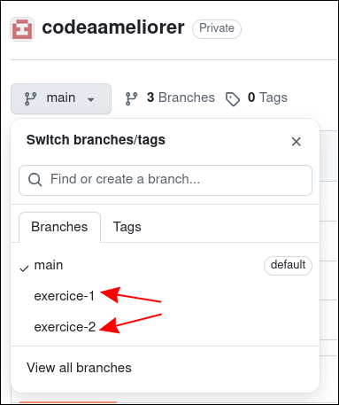

# Instructions 

Voici la deuxième partie de cet examen. Elle permet à votre enseignant de mesurer : 
- votre aptitude à respecter les principes KISS et DRY
- votre autonomie dans l'utilisation du logiciel Git.

Cette partie de l'examen est composée de deux exercices, se trouvant chacune sur une branche distincte :

Il vous faut, dans un premier temps :
- créer, à partir du projet de votre enseignant, un projet dont vous êtes le propriétaire
- ajouter votre enseignant aux collaborateurs de votre projet
- cloner votre projet

Ensuite, pour chaque exercice :
- Déplacez-vous sur le branche de l'exercice
- Apportez les modifications nécessaires
- Ajoutez ces modifications à la zone de préparation et commitez ces modifications
- Poussez ces modifications sur une votre projet sur Github 

Vous pouvez appeler votre enseignant pour de l'aide. 
Soyez conscient que cela sera pris en compte lors de l'évaluation de "votre autonomie dans l'utilisation du logiciel Git"

Bon courage.

